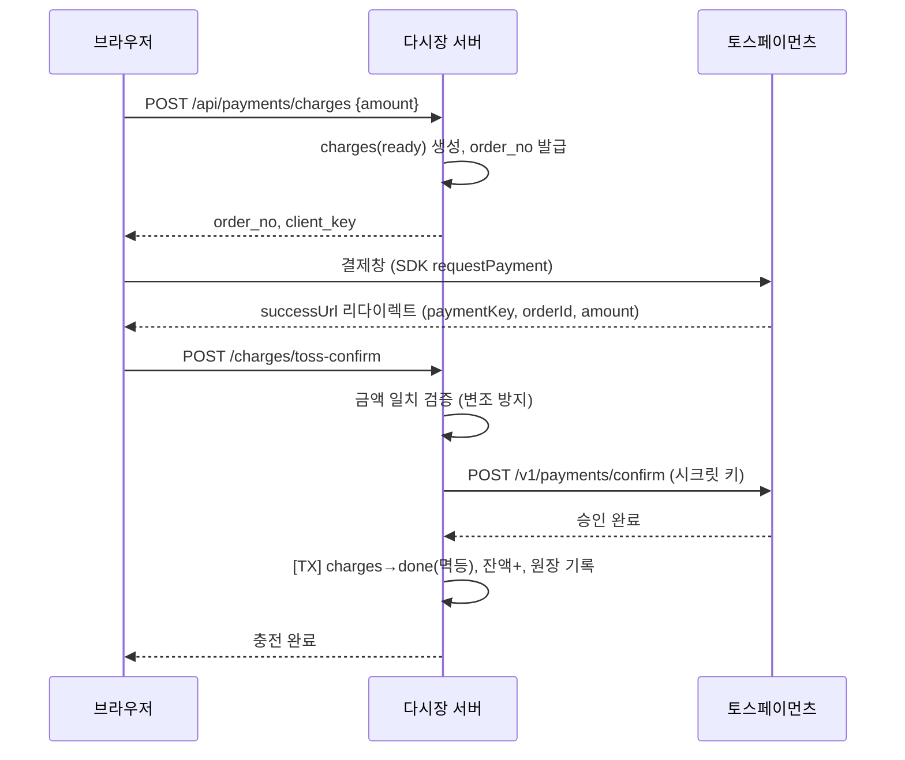
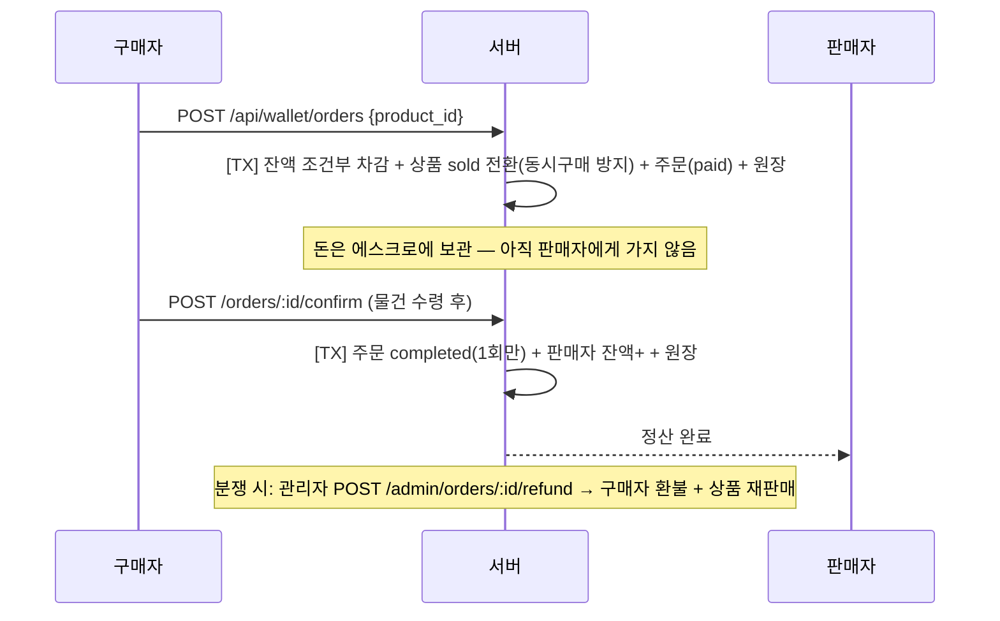

# 다시장 — 시스템 설계 문서

## 1. 시스템 구성

```
                         ┌─────────────────────────────┐
 [브라우저 SPA]  ⇄ HTTPS ⇄│ Nginx (리버스 프록시, TLS)  │
  public/                └──────────────┬──────────────┘
  · 폴링 채팅                            │ :3000
  · 토스 결제위젯          ┌──────────────▼──────────────┐        ┌──────────────────┐
        │                │  Express API (src/)          │ ⇄ SQL ⇄│ PostgreSQL       │
        │                │  · JWT 인증 미들웨어          │        │ (개발: SQLite)    │
        └── 결제창 ───┐   │  · 라우트 5모듈               │        └──────────────────┘
                     │   │  · DB 어댑터(드라이버 전환)    │
 ┌───────────────┐   │   └──────────────┬──────────────┘
 │ 토스페이먼츠 PG │◀──┘                  │ 승인 API (시크릿 키)
 └───────────────┘◀─────────────────────┘
```

- **프론트엔드**: 빌드 없는 순수 JS SPA. Express가 정적 파일로 서빙 (별도 배포 불필요).
- **백엔드**: Express. 모든 요청은 JWT `Authorization: Bearer` 헤더로 인증.
- **DB**: 어댑터 계층(`src/db.js`)으로 SQLite ↔ PostgreSQL 전환. 동일 인터페이스(`get/all/run/insert/tx`)라 라우트 코드는 드라이버를 모름.
- **결제**: 결제창은 브라우저 ↔ 토스, **승인은 서버 ↔ 토스** (시크릿 키는 서버에만 존재).

## 2. ERD

```mermaid
erDiagram
    users ||--o{ products : "판매"
    users ||--o{ chats : "구매 문의"
    products ||--o{ chats : "상품별 대화"
    chats ||--o{ messages : ""
    users ||--o{ messages : "발신"
    users ||--o{ reports : "신고"
    users ||--o{ orders : "구매/판매"
    products ||--o{ orders : ""
    users ||--o{ transactions : "출금/입금"
    users ||--o{ charges : "충전"

    users {
        int id PK
        text name UK "닉네임(로그인 ID)"
        text pw_hash "bcrypt"
        int balance "지갑 잔액(원, 정수)"
        int blocked "차단 여부"
        int is_admin
        text created_at
    }
    products {
        int id PK
        int seller_id FK
        text title
        int price "CHECK > 0"
        text category
        text description
        text image "업로드 경로"
        text status "active|sold|blocked|deleted"
        text created_at
    }
    chats {
        int id PK
        int product_id FK
        int buyer_id FK
        text created_at "UNIQUE(product,buyer)"
    }
    messages {
        int id PK
        int chat_id FK
        int sender_id FK
        text text
        text created_at
    }
    reports {
        int id PK
        text kind "user|product"
        int target_id
        int reporter_id FK
        text reason
        int resolved
        text created_at
    }
    orders {
        int id PK
        int product_id FK
        int buyer_id FK
        int seller_id FK
        int amount
        text status "paid|completed|refunded"
        text created_at
    }
    transactions {
        int id PK
        int from_id FK "NULL=외부/에스크로"
        int to_id FK "NULL=에스크로"
        int amount "CHECK > 0"
        text memo
        text created_at
    }
    charges {
        int id PK
        int user_id FK
        text order_no UK "PG 주문번호"
        int amount
        text status "ready|done|failed"
        text payment_key
        text created_at
    }
```



## 3. 핵심 흐름 (시퀀스)

### 3-1. 지갑 충전 (토스페이먼츠)



### 3-2. 안전거래 (에스크로)



### 3-3. 신고 → 차단

```
유저 신고 접수(POST /api/reports) → reports(resolved=0)
→ 관리자 콘솔 검토 → resolve(action=block)
→ 유저 차단: 로그인 거부 + 해당 유저 상품 전체 피드 제외 + 송금 수신 불가
→ 상품 차단: 피드/상세 접근 불가
```

## 4. 돈 처리 원칙

1. **정수만**: 금액은 원 단위 정수. 부동소수점 사용 금지.
2. **조건부 차감**: `UPDATE users SET balance = balance - ? WHERE id = ? AND balance >= ?` — 잔액 검증과 차감이 한 문장이라 동시 요청에도 마이너스 잔액 불가.
3. **트랜잭션**: 차감·입금·상태 변경·원장 기록은 항상 하나의 DB 트랜잭션.
4. **상태 전이도 조건부**: `SET status='completed' WHERE status='paid'` — 중복 확정/환불/승인 방지 (멱등).
5. **원장(transactions)**: 모든 이동을 기록. `SUM(잔액) + 에스크로 보관액 = 총 충전액 − 총 인출액`이 항상 성립해야 함.

## 5. 보안 설계

| 항목 | 구현 |
|---|---|
| 비밀번호 | bcrypt 해싱 (평문 저장 없음) |
| 세션 | JWT 7일, 시크릿은 환경변수 |
| 결제 키 | 시크릿 키는 서버 전용, 승인 시 금액 재검증으로 클라이언트 변조 차단 |
| 권한 | 미들웨어 계층: auth(로그인) → adminOnly(관리자), 리소스별 소유자 검사 |
| XSS | 프론트에서 모든 사용자 입력 `esc()` 이스케이프 |
| SQL 인젝션 | 전 쿼리 파라미터 바인딩 (문자열 조립 없음) |
| 업로드 | 이미지 MIME만 허용, 5MB 제한, 파일명 재생성 |
| 차단 계정 | 로그인·API 접근·송금 수신·상품 노출 전부 차단 |

## 6. 확장 로드맵

- 채팅 폴링 → WebSocket(Socket.IO) 전환: `messages` 테이블 구조 그대로 사용 가능
- 이미지: 로컬 디스크 → S3/오브젝트 스토리지 (products.image 경로만 교체)
- 검색: LIKE → PostgreSQL full-text search 또는 Elasticsearch
- 정산: 즉시 정산 → 배치 정산 + 수수료 정책 (orders에 fee 컬럼 추가)
- 알림: 채팅/거래 이벤트 푸시 (Web Push / FCM)
